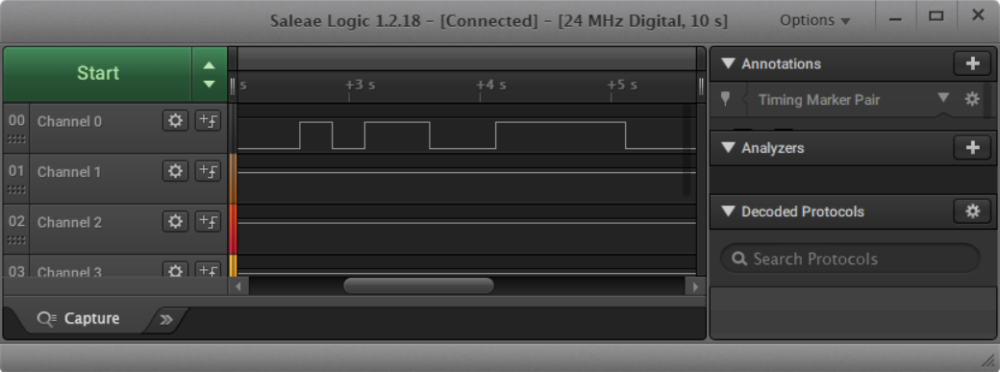
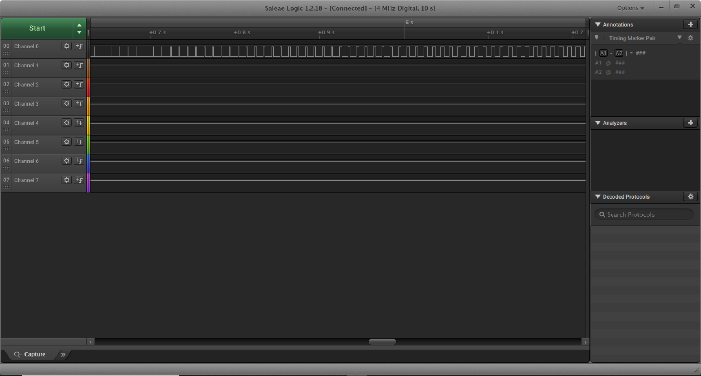
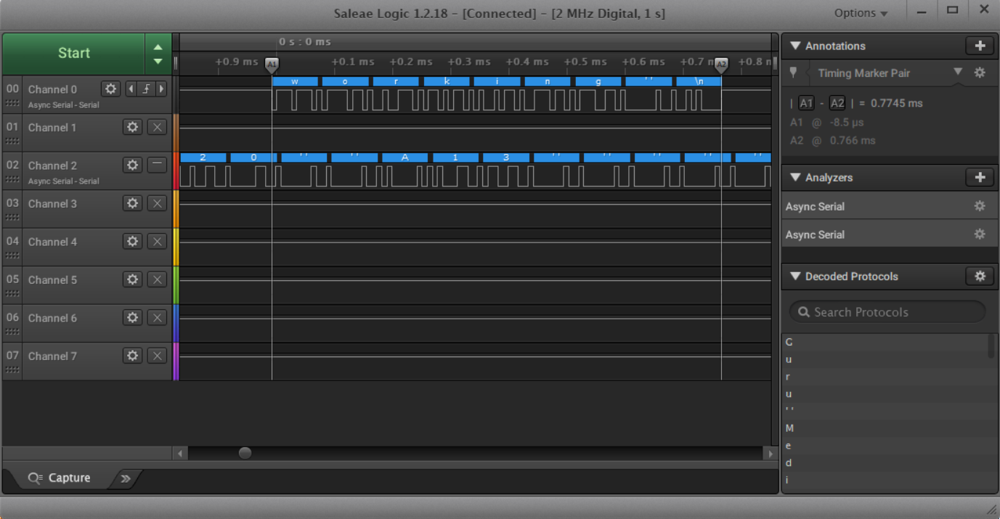
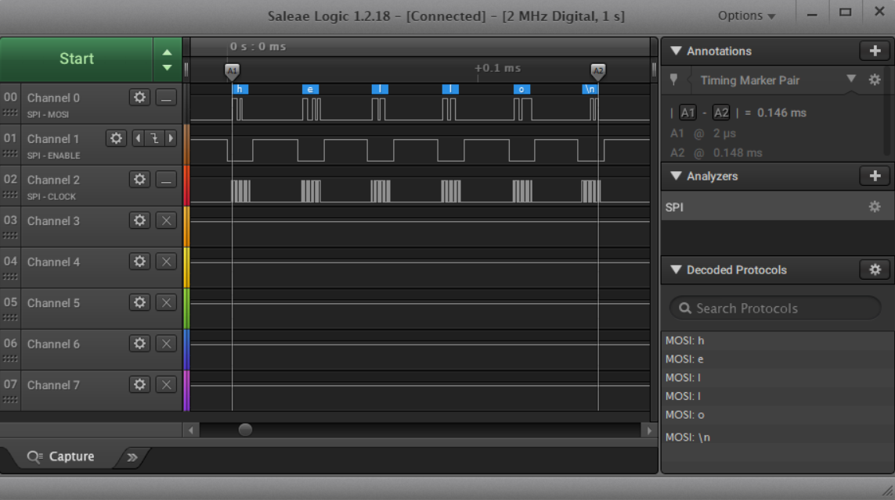

Name: Saiteja Rawulwar

EID: sr48332

Team Number:F12

## Questions

1. Why does your program need a setup and a loop?

    The set up initializes the inputs and outputs of the board and the loop keeps the code running without constant manual input.

2. What is the downside to putting all your code in a loop?

    The code will run indefinetely, even at times you don't want it to

3. Why does your code need to be compiled?

    A compiler translates a computer program fom one language to another, input to output.

4. When lowering the frequency in procedure A, step 4, what is going wrong? Brainstorm some solutions. Dimmers exist in the real world. What is their solution?

    The period is increasing between the on and off states, making the LED constantly blink till asked to stop. The period needs to be shorter and to do this you must increase the frequency. In the real world, dimmers run at very high frequency so the blinking is not visible to the naked eye. 

5. Why do you need to connect the logic analyzer ground to the ESP32 ground?

    Connecting the logic analyzer to ground on the ESP32 completes the circuit, only when the circuit is complete can you do anything with it. Just being connected to the port means the circuit is open and incomplete.

6. What is the difference between synchronous and asynchronous communication?

    Synchronous transmissions are synchronized by an external clock while asynchronous transmissions are synchronized by special signals along the transission medium. Synchronous needs a constant stream of data, while asynchronous does not. 

7. Profile of UART: Sent X bytes in Y time 

    Sent 8 bits in 0.7745 ms

8. Profile of SPI: Sent X bytes in Y time

    Sent 5 bits in 0.146 ms

9. Why is SPI so much faster than UART?

    SPI is synchronous while UART is asynchronous, meaning SPI can run as fast as needed and while UART sends info at speed limited by the input parameters

10. list one pro and one con of UART

    pro: takes user input
    con: slower than other forms of communication

11. list one pro and one con of SPI

    pro: faster communication
    con: requires greater number of parts

12. list one pro and one con of I2C

    pro: can use multiple slave devices
    con: requires pullup resistors

13. Why does I2C need external resistors to work?

    I2C lines are open drain.

## Screenshots

Procedure A, step 1:

Procedure A, step 4:

Procedure B, UART:

Procedure B, SPI:

